# JU Srijan Healthcare Website

This repository contains the codebase for a comprehensive healthcare platform, focusing on providing quality healthcare services with an integrated chatbot for customer interaction. The platform includes both backend services and a frontend application, alongside a chatbot backend for automated responses.

## Features

- **Doctor and User Registration**: Secure signup and management system for doctors and users with verification processes.
- **Appointment Scheduling**: Users can book appointments with doctors, and doctors can manage their schedules.
- **Chatbot Integration**: Automated responses and email notifications for user queries.
- **Profile Management**: Users and doctors can manage their profiles, including personal information and appointment history.
- **Department Information**: Users can browse different departments and view doctors associated with each department.

## Tech Stack

- **Frontend**: React.js, Next.js, Axios, React Typed
- **Backend**: Node.js, Express.js, Mongoose
- **Database**: MongoDB
- **Chatbot Backend**: FastAPI, Uvicorn
- **Environment**: Docker for containerization, dotenv for configuration

## Installation

1. Clone the repository:
   ```bash
   git clone https://github.com/ArifRahaman/JU-Srijan-Healthcare-website.git
   ```
2. Navigate to the project directory:
   ```bash
   cd JU-Srijan-Healthcare-website
   ```
3. Install dependencies for backend, frontend, and chatbot backend:
   ```bash
   # Backend
   cd backend
   npm install

   # Frontend
   cd ../frontend
   npm install

   # Chatbot Backend
   cd ../chatbot-backend
   pip install -r requirements.txt
   ```

## Usage Guide

- **Run Backend Server**: 
  ```bash
  cd backend
  node index.js
  ```

- **Run Frontend**:
  ```bash
  cd frontend
  npm run dev
  ```

- **Run Chatbot Backend**:
  ```bash
  cd chatbot-backend
  uvicorn main:app --reload
  ```

## Environment Variables

Create a `.env` file in the root directories of backend and chatbot-backend with the following variables:

### Backend

- `MONGODB_URI`: Connection string for MongoDB.
- `PORT`: Port number for the backend server.

### Frontend

- `NEXT_PUBLIC_BACKEND_DOMAIN`: The domain of the backend server.

### Chatbot Backend

- `EMAIL_HOST`: SMTP server for sending emails.
- `EMAIL_PORT`: Port for SMTP server.
- `EMAIL_USER`: Email username.
- `EMAIL_PASSWORD`: Email password.

## API Reference

### Backend

- **Doctor Routes**: `/doctors/`
  - Signup and management endpoints for doctors.

- **User Routes**: `/users/`
  - Signup, login, and appointment management for users.

- **Utility Routes**: `/utility/`
  - Various utility functions.

### Chatbot Backend

- **Endpoint**: `/postquestion`
  - Accepts a JSON payload with `question`, `username`, and optional `email_support`.

## Contributing

Contributions are welcome. Please fork the repository and submit a pull request for review.

## License

This project is licensed under the MIT License. See the LICENSE file for details.

## Architecture

```mermaid
flowchart TD
    backend_connection_connection_js["connection/connection.js"]
    backend_email_email_js["email/email.js"]
    backend_routers_doctors_doctors_signup_js["doctors/doctors_signup.js"]
    backend_routers_users_user_interaction_js["users/user_interaction.js"]
    backend_routers_users_user_middlware_js["users/user_middlware.js"]
    backend_routers_users_user_signup_js["users/user_signup.js"]
    backend_routers_utility_utility_js["utility/utility.js"]
    backend_schemas_schemas_js["schemas/schemas.js"]
    chatbot_backend_main_py["chatbot-backend/main.py"]
    chatbot_backend_msgsend_py["chatbot-backend/msgsend.py"]
    frontend_components_Contact_jsx["components/Contact.jsx"]
    frontend_components_Success_jsx["components/Success.jsx"]
    frontend_pages__app_tsx["pages/_app.tsx"]
    frontend_pages_doctor__slug__js["doctor/[slug].js"]
    frontend_pages_room__id__js["room/[id].js"]

    chatbot_backend_main_py --> chatbot_backend_msgsend_py
    backend_routers_doctors_doctors_signup_js --> backend_schemas_schemas_js
    backend_routers_doctors_doctors_signup_js --> backend_email_email_js
    backend_routers_users_user_middlware_js --> backend_schemas_schemas_js
    backend_routers_utility_utility_js --> backend_schemas_schemas_js
    backend_routers_utility_utility_js --> backend_email_email_js
    backend_routers_users_user_signup_js --> backend_schemas_schemas_js
    backend_routers_users_user_signup_js --> backend_email_email_js
    backend_routers_users_user_interaction_js --> backend_routers_users_user_middlware_js
    backend_routers_users_user_interaction_js --> backend_schemas_schemas_js
    frontend_components_Contact_jsx --> frontend_components_Success_jsx
    frontend_pages_doctor__slug__js --> frontend_components_Success_jsx

    classDef backend fill:#1a1a2e,stroke:#7c6cf8,color:#e8eaf6
    classDef frontend fill:#0d1b2a,stroke:#00e8a2,color:#e8eaf6
    classDef config fill:#1a0a0a,stroke:#f5a623,color:#e8eaf6
    class backend_connection_connection_js backend
    class backend_email_email_js backend
    class backend_routers_doctors_doctors_signup_js backend
    class backend_routers_users_user_interaction_js backend
    class backend_routers_users_user_middlware_js backend
    class backend_routers_users_user_signup_js backend
    class backend_routers_utility_utility_js backend
    class backend_schemas_schemas_js backend
    class chatbot_backend_main_py backend
    class chatbot_backend_msgsend_py backend
    class frontend_components_Contact_jsx frontend
    class frontend_components_Success_jsx frontend
    class frontend_pages__app_tsx frontend
    class frontend_pages_doctor__slug__js backend
    class frontend_pages_room__id__js backend
```



---
> 🤖 *Last automated update: 2026-03-08 11:10:57*