# JU Srijan Healthcare Website

A comprehensive healthcare platform designed to streamline interactions between doctors and patients. The system leverages modern web technologies to facilitate doctor-patient appointments, user management, and an integrated chatbot for enhanced user engagement.

## Features

- **Doctor Management**: Sign up and manage doctor profiles, including education, experience, and department.
- **User Management**: User registration and authentication with email verification.
- **Appointment Scheduling**: Users can schedule appointments with doctors, and doctors can view their appointments.
- **Patient History**: Track patient history with comments and meeting details.
- **Chatbot Integration**: A FastAPI-based chatbot backend for user interaction.
- **Email Notifications**: Integrated email notifications for user verification and alerts.
- **Security**: Implemented OTP-based verification for secure access.
- **Responsive Frontend**: Built with Next.js for high-performance user experience.

## Tech Stack

- **Backend**: Node.js, Express.js, MongoDB, Mongoose
- **Frontend**: Next.js, React.js
- **Chatbot**: FastAPI, Python
- **Dev Tools**: Nodemon, Yarn
- **Other**: CORS, dotenv

## Installation Instructions

Clone the repository:

```bash
git clone https://github.com/ArifRahaman/JU-Srijan-Healthcare-website.git
```

## Usage Guide

### Backend

Navigate to the backend directory, install dependencies, and run the server:

```bash
cd backend/
yarn install
nodemon index.js
```

Ensure your `.env` file contains:

- `MONGODB_URI`: Your MongoDB connection string
- `EMAIL`: Your email for sending notifications
- `EMAIL_PASSWORD`: 16-digit app password from Google for email sending

### Chatbot Backend

Navigate to the chatbot-backend directory, create a virtual environment, and run the server:

```bash
cd chatbot-backend/
virtualenv .venv
source .venv/bin/activate
pip install -r requirements.txt
uvicorn main:app --reload --port=5000
```

### Frontend

Navigate to the frontend directory, install dependencies, and run the Next.js application:

```bash
cd frontend/
yarn install
yarn run dev
```

## Environment Variables

- **Backend**:
  - `MONGODB_URI`: MongoDB connection string
  - `EMAIL`: Email address for notifications
  - `EMAIL_PASSWORD`: Google app-specific password
- **Chatbot Backend**:
  - Configure as needed in the `.env` file within `chatbot-backend/`.

## API Reference

### Backend Endpoints

- **/doctors/**: Doctor signup and profile management
- **/users/**: User signup and appointment scheduling
- **/utility/**: Utility functions for the platform

### Chatbot Backend

- **POST /postquestion**: Handle chatbot interaction and communication

## Contributing

Please ensure that you have proper access and permissions before making contributions. Contributions should align with the project's architecture and coding standards. Submit pull requests for review.

## License

This project is licensed under the MIT License. See the [LICENSE](LICENSE) file for details.

## Architecture

```mermaid
flowchart TD
    backend_connection_connection_js["connection/connection.js"]
    backend_email_email_js["email/email.js"]
    backend_routers_doctors_doctors_signup_js["doctors/doctors_signup.js"]
    backend_routers_users_user_interaction_js["users/user_interaction.js"]
    backend_routers_users_user_middlware_js["users/user_middlware.js"]
    backend_routers_users_user_signup_js["users/user_signup.js"]
    backend_routers_utility_utility_js["utility/utility.js"]
    backend_schemas_schemas_js["schemas/schemas.js"]
    chatbot_backend_main_py["chatbot-backend/main.py"]
    chatbot_backend_msgsend_py["chatbot-backend/msgsend.py"]
    frontend_components_Contact_jsx["components/Contact.jsx"]
    frontend_components_Success_jsx["components/Success.jsx"]
    frontend_pages__app_tsx["pages/_app.tsx"]
    frontend_pages_doctor__slug__js["doctor/[slug].js"]
    frontend_pages_room__id__js["room/[id].js"]

    chatbot_backend_main_py --> chatbot_backend_msgsend_py
    backend_routers_doctors_doctors_signup_js --> backend_schemas_schemas_js
    backend_routers_doctors_doctors_signup_js --> backend_email_email_js
    backend_routers_users_user_middlware_js --> backend_schemas_schemas_js
    backend_routers_utility_utility_js --> backend_schemas_schemas_js
    backend_routers_utility_utility_js --> backend_email_email_js
    backend_routers_users_user_interaction_js --> backend_routers_users_user_middlware_js
    backend_routers_users_user_interaction_js --> backend_schemas_schemas_js
    frontend_components_Contact_jsx --> frontend_components_Success_jsx
    backend_routers_users_user_signup_js --> backend_schemas_schemas_js
    backend_routers_users_user_signup_js --> backend_email_email_js
    frontend_pages_doctor__slug__js --> frontend_components_Success_jsx

    classDef backend fill:#1a1a2e,stroke:#7c6cf8,color:#e8eaf6
    classDef frontend fill:#0d1b2a,stroke:#00e8a2,color:#e8eaf6
    classDef config fill:#1a0a0a,stroke:#f5a623,color:#e8eaf6
    class backend_connection_connection_js backend
    class backend_email_email_js backend
    class backend_routers_doctors_doctors_signup_js backend
    class backend_routers_users_user_interaction_js backend
    class backend_routers_users_user_middlware_js backend
    class backend_routers_users_user_signup_js backend
    class backend_routers_utility_utility_js backend
    class backend_schemas_schemas_js backend
    class chatbot_backend_main_py backend
    class chatbot_backend_msgsend_py backend
    class frontend_components_Contact_jsx frontend
    class frontend_components_Success_jsx frontend
    class frontend_pages__app_tsx frontend
    class frontend_pages_doctor__slug__js backend
    class frontend_pages_room__id__js backend
```



---
> 🤖 *Last automated update: 2026-03-08 10:52:35*