# Project: JU-Srijan Healthcare Website

## Features

- **Doctor and User Management**: Register and manage profiles for both doctors and users.
- **Appointment Scheduling**: Users can book appointments with doctors, and the system handles scheduling logistics.
- **Real-time Communication**: Integrated chatbot for user interaction and support.
- **Email Notifications**: Automated email notifications for appointment confirmations and reminders.
- **Secure Authentication**: OTP-based verification for secure user and doctor authentication.

## Tech Stack

- **Frontend**: React, Next.js, Axios, Tailwind CSS
- **Backend**: Node.js, Express, MongoDB, Mongoose
- **Chatbot**: FastAPI, Pydantic, Uvicorn
- **Email**: Custom HTML templates for email notifications
- **Environment**: Docker, dotenv for environment management

## Installation

1. **Clone the Repository**: 
   ```bash
   git clone https://github.com/ArifRahaman/JU-Srijan-Healthcare-website.git
   cd JU-Srijan-Healthcare-website
   ```

2. **Backend Setup**:
   - Navigate to the backend directory:
     ```bash
     cd backend
     ```
   - Install dependencies:
     ```bash
     npm install
     ```
   - Start the backend server:
     ```bash
     npm start
     ```

3. **Frontend Setup**:
   - Navigate to the frontend directory:
     ```bash
     cd frontend
     ```
   - Install dependencies:
     ```bash
     npm install
     ```
   - Start the frontend server:
     ```bash
     npm run dev
     ```

4. **Chatbot Setup**:
   - Navigate to the chatbot-backend directory:
     ```bash
     cd chatbot-backend
     ```
   - Install dependencies:
     ```bash
     pip install -r requirements.txt
     ```
   - Start the chatbot server:
     ```bash
     uvicorn main:app --reload
     ```

## Usage Guide

- **Access the Application**:
  - Visit the frontend application running at `http://localhost:3000`.
  - Use the respective login pages for doctors and users to authenticate.
  - Interact with the chatbot for support or general inquiries.

## Environment Variables

- **Backend**:
  - `MONGO_URI`: MongoDB connection string
  - `PORT`: Server port (default: 8000)

- **Frontend**:
  - `NEXT_PUBLIC_BACKEND_DOMAIN`: URL for the backend server

- **Chatbot**:
  - `NEXT_PUBLIC_CHATBOT_DOMAIN`: URL for the chatbot server

## API Reference

### Backend

- **USE /doctors/**: Routes related to doctor operations.
- **USE /users/**: Routes related to user operations, including appointment management.
- **USE /utility/**: Utility routes for additional functionalities.

### Chatbot

- **POST /postquestion**: Endpoint to handle user questions and provide responses.

## Contributing

Contributions are welcome! Please follow the standard GitHub flow: fork the repository, create a branch, commit changes, and open a pull request.

## License

This project is licensed under the MIT License. See the [LICENSE](LICENSE) file for details.

## Architecture

```mermaid
flowchart TD
    backend_connection_connection_js["connection/connection.js"]
    backend_email_email_js["email/email.js"]
    backend_routers_doctors_doctors_signup_js["doctors/doctors_signup.js"]
    backend_routers_users_user_interaction_js["users/user_interaction.js"]
    backend_routers_users_user_middlware_js["users/user_middlware.js"]
    backend_routers_users_user_signup_js["users/user_signup.js"]
    backend_routers_utility_utility_js["utility/utility.js"]
    backend_schemas_schemas_js["schemas/schemas.js"]
    chatbot_backend_main_py["chatbot-backend/main.py"]
    chatbot_backend_msgsend_py["chatbot-backend/msgsend.py"]
    frontend_components_Contact_jsx["components/Contact.jsx"]
    frontend_components_Success_jsx["components/Success.jsx"]
    frontend_pages__app_tsx["pages/_app.tsx"]
    frontend_pages_doctor__slug__js["doctor/[slug].js"]
    frontend_pages_room__id__js["room/[id].js"]

    chatbot_backend_main_py --> chatbot_backend_msgsend_py
    backend_routers_doctors_doctors_signup_js --> backend_email_email_js
    backend_routers_doctors_doctors_signup_js --> backend_schemas_schemas_js
    backend_routers_users_user_middlware_js --> backend_schemas_schemas_js
    backend_routers_utility_utility_js --> backend_email_email_js
    backend_routers_utility_utility_js --> backend_schemas_schemas_js
    backend_routers_users_user_signup_js --> backend_email_email_js
    backend_routers_users_user_signup_js --> backend_schemas_schemas_js
    backend_routers_users_user_interaction_js --> backend_routers_users_user_middlware_js
    backend_routers_users_user_interaction_js --> backend_schemas_schemas_js
    frontend_components_Contact_jsx --> frontend_components_Success_jsx
    frontend_pages_doctor__slug__js --> frontend_components_Success_jsx

    classDef backend fill:#1a1a2e,stroke:#7c6cf8,color:#e8eaf6
    classDef frontend fill:#0d1b2a,stroke:#00e8a2,color:#e8eaf6
    classDef config fill:#1a0a0a,stroke:#f5a623,color:#e8eaf6
    class backend_connection_connection_js backend
    class backend_email_email_js backend
    class backend_routers_doctors_doctors_signup_js backend
    class backend_routers_users_user_interaction_js backend
    class backend_routers_users_user_middlware_js backend
    class backend_routers_users_user_signup_js backend
    class backend_routers_utility_utility_js backend
    class backend_schemas_schemas_js backend
    class chatbot_backend_main_py backend
    class chatbot_backend_msgsend_py backend
    class frontend_components_Contact_jsx frontend
    class frontend_components_Success_jsx frontend
    class frontend_pages__app_tsx frontend
    class frontend_pages_doctor__slug__js backend
    class frontend_pages_room__id__js backend
```



---
> 🤖 *Last automated update: 2026-03-08 11:14:13*