# JU-Srijan Healthcare Website

## Features
- **Doctor and Patient Management**: Comprehensive management of doctors and patient interactions, including appointment scheduling and history tracking.
- **Chatbot Integration**: A sophisticated chatbot system for handling user queries, providing quick and accurate responses.
- **User Authentication**: Secure and verified user authentication process with OTP support.
- **Appointment Scheduling**: Easy scheduling and management of appointments with doctors.
- **Email Notifications**: Automated email notifications for appointment confirmations and other user interactions.

## Tech Stack
- **Backend**: Node.js, Express.js, Mongoose, FastAPI
- **Frontend**: React.js, Next.js, Tailwind CSS
- **Database**: MongoDB
- **Other**: Axios for HTTP requests, dotenv for environment variables, uuid for unique ID generation, and FastAPI for Python-based backend services.

## Installation
1. Clone the repository:
   ```bash
   git clone https://github.com/ArifRahaman/JU-Srijan-Healthcare-website.git
   ```
2. Navigate to the project directory:
   ```bash
   cd JU-Srijan-Healthcare-website
   ```
3. Install the required dependencies:
   - For backend:
     ```bash
     cd backend
     npm install
     ```
   - For frontend:
     ```bash
     cd frontend
     npm install
     ```
   - For chatbot backend:
     ```bash
     cd chatbot-backend
     pip install -r requirements.txt
     ```
4. Set up environment variables as described in the **Environment Variables** section.

## Usage Guide
1. Start the MongoDB service.
2. Run the backend server:
   ```bash
   cd backend
   node index.js
   ```
3. Run the frontend:
   ```bash
   cd frontend
   npm run dev
   ```
4. Run the chatbot backend:
   ```bash
   cd chatbot-backend
   uvicorn main:app --reload
   ```
5. Access the application through the frontend URL (default is `http://localhost:3000`).

## Environment Variables
Ensure the following environment variables are set in your `.env` files in respective directories:
- **Backend**:
  - `PORT`: Port number for the backend server (e.g., 8000).
  - `MONGO_URI`: Connection string for MongoDB.
- **Frontend**:
  - `NEXT_PUBLIC_BACKEND_DOMAIN`: Domain for the backend API.
  - `NEXT_PUBLIC_CHATBOT_DOMAIN`: Domain for the chatbot API.
- **Chatbot Backend**:
  - `EMAIL_API_KEY`: API key for sending emails.

## API Reference
- **Backend**:
  - `USE /doctors/`: Doctor-related endpoints.
  - `USE /users/`: User sign-up and interaction endpoints.
  - `USE /utility/`: Utility functions.
- **Chatbot Backend**:
  - `POST /postquestion`: Endpoint to handle user queries through the chatbot.

## Contributing
Contributions are welcome! Please submit a pull request with your changes and ensure all tests pass before submitting.

## License
This project is licensed under the MIT License. See the LICENSE file for more details.

## Architecture

```mermaid
flowchart TD
    backend_connection_connection_js["connection/connection.js"]
    backend_email_email_js["email/email.js"]
    backend_routers_doctors_doctors_signup_js["doctors/doctors_signup.js"]
    backend_routers_users_user_interaction_js["users/user_interaction.js"]
    backend_routers_users_user_middlware_js["users/user_middlware.js"]
    backend_routers_users_user_signup_js["users/user_signup.js"]
    backend_routers_utility_utility_js["utility/utility.js"]
    backend_schemas_schemas_js["schemas/schemas.js"]
    chatbot_backend_main_py["chatbot-backend/main.py"]
    chatbot_backend_msgsend_py["chatbot-backend/msgsend.py"]
    frontend_components_Contact_jsx["components/Contact.jsx"]
    frontend_components_Success_jsx["components/Success.jsx"]
    frontend_pages__app_tsx["pages/_app.tsx"]
    frontend_pages_doctor__slug__js["doctor/[slug].js"]
    frontend_pages_room__id__js["room/[id].js"]

    chatbot_backend_main_py --> chatbot_backend_msgsend_py
    backend_routers_users_user_signup_js --> backend_email_email_js
    backend_routers_users_user_signup_js --> backend_schemas_schemas_js
    backend_routers_users_user_middlware_js --> backend_schemas_schemas_js
    frontend_components_Contact_jsx --> frontend_components_Success_jsx
    backend_routers_utility_utility_js --> backend_email_email_js
    backend_routers_utility_utility_js --> backend_schemas_schemas_js
    backend_routers_users_user_interaction_js --> backend_schemas_schemas_js
    backend_routers_users_user_interaction_js --> backend_routers_users_user_middlware_js
    backend_routers_doctors_doctors_signup_js --> backend_email_email_js
    backend_routers_doctors_doctors_signup_js --> backend_schemas_schemas_js
    frontend_pages_doctor__slug__js --> frontend_components_Success_jsx

    classDef backend fill:#1a1a2e,stroke:#7c6cf8,color:#e8eaf6
    classDef frontend fill:#0d1b2a,stroke:#00e8a2,color:#e8eaf6
    classDef config fill:#1a0a0a,stroke:#f5a623,color:#e8eaf6
    class backend_connection_connection_js backend
    class backend_email_email_js backend
    class backend_routers_doctors_doctors_signup_js backend
    class backend_routers_users_user_interaction_js backend
    class backend_routers_users_user_middlware_js backend
    class backend_routers_users_user_signup_js backend
    class backend_routers_utility_utility_js backend
    class backend_schemas_schemas_js backend
    class chatbot_backend_main_py backend
    class chatbot_backend_msgsend_py backend
    class frontend_components_Contact_jsx frontend
    class frontend_components_Success_jsx frontend
    class frontend_pages__app_tsx frontend
    class frontend_pages_doctor__slug__js backend
    class frontend_pages_room__id__js backend
```



---
> 🤖 *Last automated update: 2026-03-08 11:17:59*