# JU-Srijan Healthcare Website

A comprehensive telemedicine platform designed to connect patients with healthcare professionals. This system integrates a chatbot for user inquiries, a doctor-patient appointment booking system, and a robust user authentication mechanism.

## Features

- **User Authentication**: Secure signup and login for both doctors and users with OTP verification.
- **Doctor and Patient Management**: Doctors can register, login, and manage patient details, while users can browse doctor profiles and book appointments.
- **Real-time Communication**: Integrated chat and video call functionalities for seamless doctor-patient interaction.
- **Specialist Browsing**: Users can browse specialists by department such as Cardiology, Neurology, etc.
- **Analytics**: Provides statistics on doctors, users, and appointments.
- **Contact Form**: Users can send queries via a contact form, with email notifications.

## Tech Stack

- **Frontend**: Next.js, React, Tailwind CSS, Material-UI, React Typed
- **Backend**: Node.js, Express, MongoDB, Mongoose, Nodemailer
- **Chatbot**: FastAPI, Pydantic
- **Communication**: Socket.io, Simple-Peer
- **Other**: Stripe for payment processing, Puppeteer for automation tasks

## Installation

1. Clone the repository:
   ```bash
   git clone https://github.com/ArifRahaman/JU-Srijan-Healthcare-website.git
   cd JU-Srijan-Healthcare-website
   ```

2. Install dependencies for each subdirectory (`backend`, `frontend`, `chatbot-backend`):
   ```bash
   # Backend
   cd backend
   npm install

   # Frontend
   cd ../frontend
   npm install

   # Chatbot Backend
   cd ../chatbot-backend
   pip install -r requirements.txt
   ```

3. Set up environment variables for each component by copying and modifying the `.env.example` files into `.env` files.

## Usage Guide

- **Backend**: Start the backend server.
  ```bash
  cd backend
  node index.js
  ```

- **Frontend**: Run the Next.js development server.
  ```bash
  cd frontend
  npm run dev
  ```

- **Chatbot**: Deploy the FastAPI server.
  ```bash
  cd chatbot-backend
  uvicorn main:app --reload
  ```

Access the application at `http://localhost:3000`.

## Environment Variables

- **Backend**:
  - `SECRET_KEY`: Secret key for JWT.
  - `MONGODB_URI`: MongoDB connection string.
  - `USER_EMAIL`: Email for sending OTPs.
  - `USER_PASSWORD`: Password for the email account.

- **Frontend**:
  - `NEXT_PUBLIC_BACKEND_DOMAIN`: Domain for the backend API.

- **Chatbot**:
  - No environment variables specified.

## API Reference

### Backend

- **Doctors**
  - `POST /doctors/signup`: Register a new doctor.
  - `POST /doctors/verify-otp`: Verify OTP for doctor registration.
  - `POST /doctors/resend-otp`: Resend OTP for verification.
  - `POST /doctors/login`: Doctor login.
  - `GET /doctors/doctor-details`: Fetch doctor details.
  - `POST /doctors/patient-details`: Submit patient details.
  - `POST /doctors/patients-history`: Fetch patients' history.

- **Users**
  - `GET /users/hello`: Test endpoint.
  - `POST /users/signup`: Register a new user.
  - `POST /users/verify-otp`: Verify OTP for user registration.
  - `POST /users/resend-otp`: Resend OTP for verification.
  - `POST /users/login`: User login.
  - `GET /users/user-details`: Fetch user details.
  - `POST /users/subscribed`: Subscribe user to notifications.

- **Appointments**
  - `POST /users/appointment`: Book an appointment.
  - `GET /users/get-all-doctors`: Retrieve list of all doctors.
  - `GET /users/get-doctor-details/:_id`: Get details of a specific doctor.

- **Utility**
  - `GET /utility/stats`: Retrieve platform statistics.
  - `GET /utility/get-cardiologists`: Retrieve list of cardiologists.
  - `GET /utility/get-neurologists`: Retrieve list of neurologists.
  - `GET /utility/get-psychologists`: Retrieve list of psychologists.
  - `GET /utility/get-ophthalmologists`: Retrieve list of ophthalmologists.
  - `GET /utility/get-dermatologists`: Retrieve list of dermatologists.
  - `POST /utility/contact-us`: Submit a contact form query.
  - `GET /utility/department-counts`: Get count of doctors by department.

### Chatbot

- **POST /postquestion**: Submit a question to the chatbot.

## Contributing

To contribute, fork the repository and create a pull request with a detailed description of your changes. Ensure your code follows the project's coding standards and includes relevant tests.

## License

This project is licensed under the MIT License. See the LICENSE file for details.

## Architecture

```mermaid
flowchart TD
    backend_connection_connection_js["connection/connection.js"]
    backend_email_email_js["email/email.js"]
    backend_routers_doctors_doctors_signup_js["doctors/doctors_signup.js"]
    backend_routers_users_user_interaction_js["users/user_interaction.js"]
    backend_routers_users_user_middlware_js["users/user_middlware.js"]
    backend_routers_users_user_signup_js["users/user_signup.js"]
    backend_routers_utility_utility_js["utility/utility.js"]
    backend_schemas_schemas_js["schemas/schemas.js"]
    chatbot_backend_main_py["chatbot-backend/main.py"]
    chatbot_backend_msgsend_py["chatbot-backend/msgsend.py"]
    frontend_components_Contact_jsx["components/Contact.jsx"]
    frontend_components_Success_jsx["components/Success.jsx"]
    frontend_pages__app_tsx["pages/_app.tsx"]
    frontend_pages_doctor__slug__js["doctor/[slug].js"]
    frontend_pages_room__id__js["room/[id].js"]

    chatbot_backend_main_py --> chatbot_backend_msgsend_py
    backend_routers_utility_utility_js --> backend_schemas_schemas_js
    backend_routers_utility_utility_js --> backend_email_email_js
    backend_routers_users_user_interaction_js --> backend_schemas_schemas_js
    backend_routers_users_user_interaction_js --> backend_routers_users_user_middlware_js
    backend_routers_doctors_doctors_signup_js --> backend_schemas_schemas_js
    backend_routers_doctors_doctors_signup_js --> backend_email_email_js
    backend_routers_users_user_signup_js --> backend_schemas_schemas_js
    backend_routers_users_user_signup_js --> backend_email_email_js
    frontend_components_Contact_jsx --> frontend_components_Success_jsx
    backend_routers_users_user_middlware_js --> backend_schemas_schemas_js
    frontend_pages_doctor__slug__js --> frontend_components_Success_jsx

    classDef backend fill:#1a1a2e,stroke:#7c6cf8,color:#e8eaf6
    classDef frontend fill:#0d1b2a,stroke:#00e8a2,color:#e8eaf6
    classDef config fill:#1a0a0a,stroke:#f5a623,color:#e8eaf6
    class backend_connection_connection_js backend
    class backend_email_email_js backend
    class backend_routers_doctors_doctors_signup_js backend
    class backend_routers_users_user_interaction_js backend
    class backend_routers_users_user_middlware_js backend
    class backend_routers_users_user_signup_js backend
    class backend_routers_utility_utility_js backend
    class backend_schemas_schemas_js backend
    class chatbot_backend_main_py backend
    class chatbot_backend_msgsend_py backend
    class frontend_components_Contact_jsx frontend
    class frontend_components_Success_jsx frontend
    class frontend_pages__app_tsx frontend
    class frontend_pages_doctor__slug__js backend
    class frontend_pages_room__id__js backend
```



---
> 🤖 *Last automated update: 2026-03-08 11:20:48*