# JU-Srijan Healthcare Website

## Features

- **Doctor and User Management:** Sign-up and interaction capabilities for both doctors and users.
- **Chatbot Integration:** Backend chatbot support for user queries.
- **Appointment Scheduling:** Book and manage appointments with doctors.
- **Email Notifications:** Automated email dispatch for support and notifications.
- **Comprehensive User Profiles:** Maintain detailed user profiles, including appointment history.
- **Frontend-Backend Integration:** Seamless interaction between a React-based frontend and a Node.js/Express backend.
- **Secure and Scalable:** Robust schema design and middleware for enhanced security and scalability.

## Tech Stack

- **Frontend:** React, Next.js, Axios, ReactTyped
- **Backend:** Node.js, Express, FastAPI, MongoDB, Mongoose
- **Chatbot:** FastAPI, Python
- **Database:** MongoDB
- **Email:** Custom email service using FastAPI
- **Environment Configuration:** dotenv

## Installation Instructions

1. Clone the repository:
   ```bash
   git clone https://github.com/ArifRahaman/JU-Srijan-Healthcare-website.git
   cd JU-Srijan-Healthcare-website
   ```

2. Install backend dependencies:
   ```bash
   cd backend
   npm install
   ```

3. Install frontend dependencies:
   ```bash
   cd frontend
   npm install
   ```

4. Set up environment variables:
   - Create a `.env` file in both the `backend` and `frontend` directories.
   - Define necessary environment variables as described in the Environment Variables section.

## Usage Guide

To run the application:

1. **Backend:**
   - Navigate to the backend folder and start the server:
     ```bash
     cd backend
     npm start
     ```

2. **Frontend:**
   - Navigate to the frontend folder and start the development server:
     ```bash
     cd frontend
     npm run dev
     ```

3. **Chatbot:**
   - Run the FastAPI chatbot service:
     ```bash
     cd chatbot-backend
     uvicorn main:app --reload
     ```

Access the application via your browser at `http://localhost:3000`.

## Environment Variables

- **Backend (`backend/.env`):**
  - `PORT`: Port for the backend server (default: 8000).
  - `MONGO_URI`: MongoDB connection URI.
  - `EMAIL_SERVICE_API_KEY`: API key for the email service.

- **Frontend (`frontend/.env`):**
  - `NEXT_PUBLIC_BACKEND_DOMAIN`: Backend domain URL.

## API Reference

### Backend Endpoints

- **Doctor Routes:**
  - `POST /doctors/signup`: Register a new doctor.
  - `GET /doctors/`: Fetch all doctors.

- **User Routes:**
  - `POST /users/signup`: Register a new user.
  - `POST /users/appointment`: Book an appointment.

- **Utility Routes:**
  - `GET /utility/some-endpoint`: Utility endpoint description.

### Chatbot Endpoints

- `POST /postquestion`: Submit a question to the chatbot.

## Contributing

Contributions are welcome. Please fork the repository and open a pull request with your changes. Ensure that new features are well-documented and covered with tests.

## License

This project is licensed under the MIT License. See the LICENSE file for more details.

## Architecture

```mermaid
flowchart TD
    backend_connection_connection_js["connection/connection.js"]
    backend_email_email_js["email/email.js"]
    backend_routers_doctors_doctors_signup_js["doctors/doctors_signup.js"]
    backend_routers_users_user_interaction_js["users/user_interaction.js"]
    backend_routers_users_user_middlware_js["users/user_middlware.js"]
    backend_routers_users_user_signup_js["users/user_signup.js"]
    backend_routers_utility_utility_js["utility/utility.js"]
    backend_schemas_schemas_js["schemas/schemas.js"]
    chatbot_backend_main_py["chatbot-backend/main.py"]
    chatbot_backend_msgsend_py["chatbot-backend/msgsend.py"]
    frontend_components_Contact_jsx["components/Contact.jsx"]
    frontend_components_Success_jsx["components/Success.jsx"]
    frontend_pages__app_tsx["pages/_app.tsx"]
    frontend_pages_doctor__slug__js["doctor/[slug].js"]
    frontend_pages_room__id__js["room/[id].js"]

    chatbot_backend_main_py --> chatbot_backend_msgsend_py
    backend_routers_utility_utility_js --> backend_schemas_schemas_js
    backend_routers_utility_utility_js --> backend_email_email_js
    backend_routers_users_user_interaction_js --> backend_schemas_schemas_js
    backend_routers_users_user_interaction_js --> backend_routers_users_user_middlware_js
    backend_routers_users_user_middlware_js --> backend_schemas_schemas_js
    backend_routers_doctors_doctors_signup_js --> backend_schemas_schemas_js
    backend_routers_doctors_doctors_signup_js --> backend_email_email_js
    backend_routers_users_user_signup_js --> backend_schemas_schemas_js
    backend_routers_users_user_signup_js --> backend_email_email_js
    frontend_components_Contact_jsx --> frontend_components_Success_jsx
    frontend_pages_doctor__slug__js --> frontend_components_Success_jsx

    classDef backend fill:#1a1a2e,stroke:#7c6cf8,color:#e8eaf6
    classDef frontend fill:#0d1b2a,stroke:#00e8a2,color:#e8eaf6
    classDef config fill:#1a0a0a,stroke:#f5a623,color:#e8eaf6
    class backend_connection_connection_js backend
    class backend_email_email_js backend
    class backend_routers_doctors_doctors_signup_js backend
    class backend_routers_users_user_interaction_js backend
    class backend_routers_users_user_middlware_js backend
    class backend_routers_users_user_signup_js backend
    class backend_routers_utility_utility_js backend
    class backend_schemas_schemas_js backend
    class chatbot_backend_main_py backend
    class chatbot_backend_msgsend_py backend
    class frontend_components_Contact_jsx frontend
    class frontend_components_Success_jsx frontend
    class frontend_pages__app_tsx frontend
    class frontend_pages_doctor__slug__js backend
    class frontend_pages_room__id__js backend
```



---
> 🤖 *Last automated update: 2026-03-08 10:55:27*